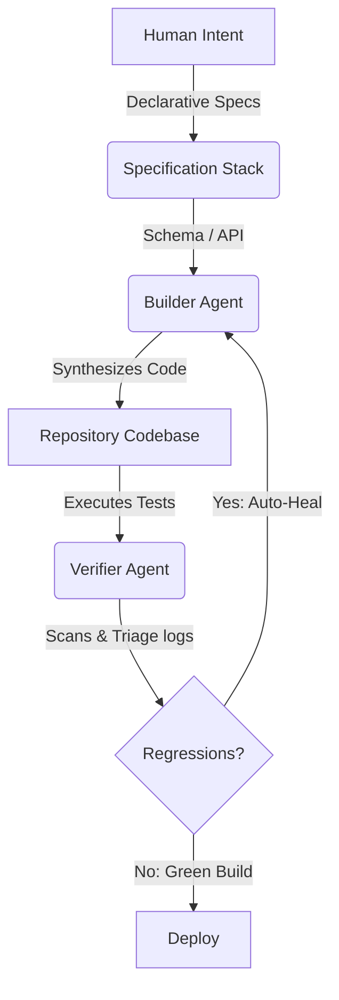

# System Architecture Manifesto: DINTC

> "We do not build features. We build the rulesets that allow autonomous agents to build features."

## The Core Paradigm Shift
Traditional software engineering forces humans to act as compilers: translating product requirements into syntax lines. 

The **DINTC (Design is the New Code)** system shifts human input up the stack into a tiered **Specification Stack**. The compiler target is no longer assembly or bytes; **code itself is the transient compilation byproduct**.

---

## 📦 The Specification Stack

Rather than maintaining a monolithic codebase, DNC decouples intent into three cognitive layers:

| Layer | File | Role | Audience |
| :--- | :--- | :--- | :--- |
| **01** | `prd.md` | User needs, constraints, and business rules. | Human Architect |
| **02** | `design.md` | API contracts, schemas, borders, spacing. | Human + Builder Agent |
| **03** | `GEMINI.md` | Directives, context boundaries, execution limits. | Agent Coder (JetSki) |

---

## 🧠 Context Memory Modes
As codebases scale, agent context windows face severe cognitive load. DNC implements two specialized memory modes:

### 1. Goldfish Mode (Stateless)
* Ephemeral context window.
* Injects only immediate local variables and transient logic per prompt.
* Designed for high-velocity, stateless code modifications.

### 2. Elephant Mode (Stateful)
* Vectorized context memory.
* Dynamically mounts external vector stores (`./.dnc/ctx`) containing long-term architecture rules.
* Maintains historical context across subagent spawn trees.
